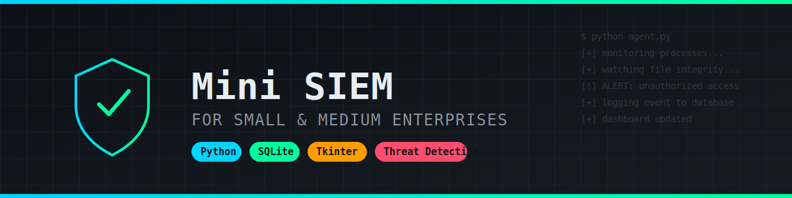
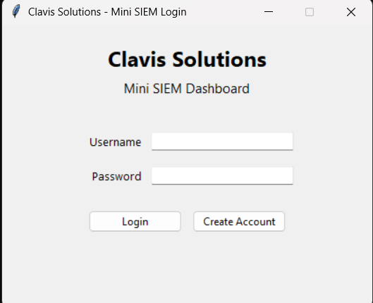
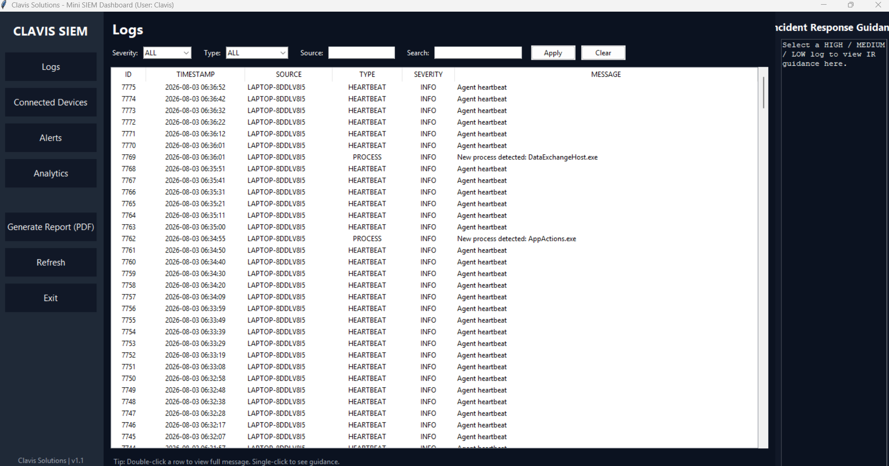
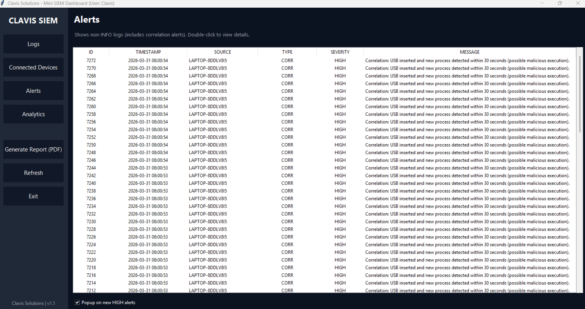
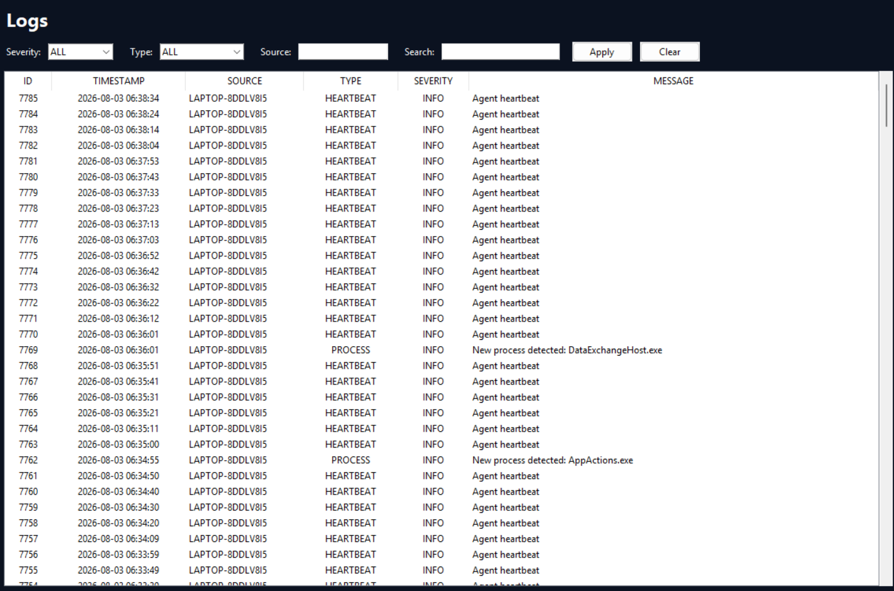
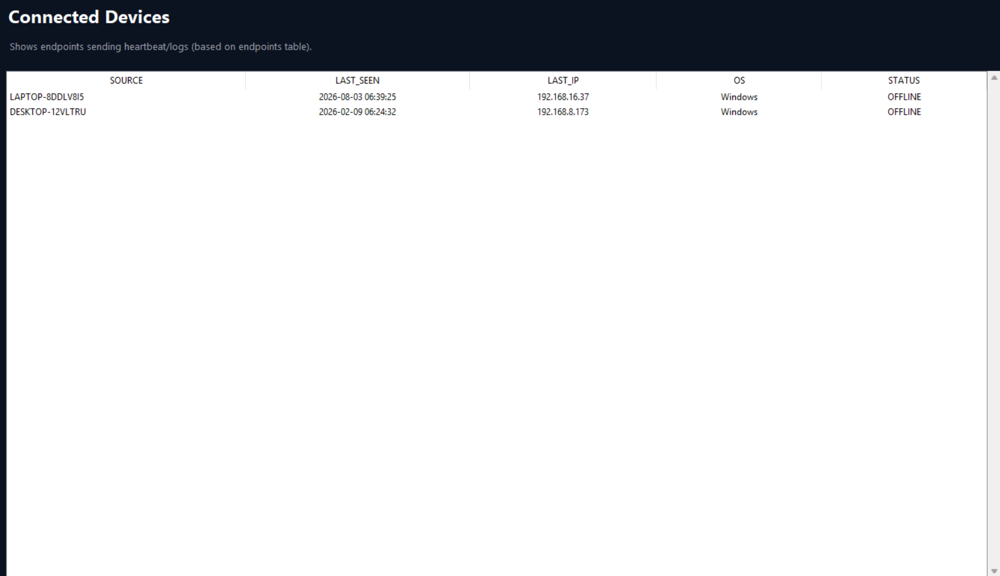
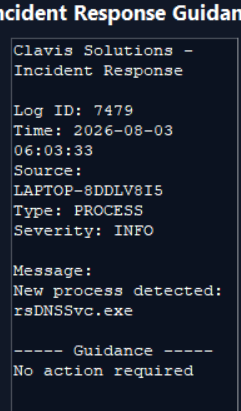

<h1 align="center">🛡️ Mini SIEM for SMEs</h1>

<p align="center">
  
</p>

<p align="center">
  
  
  
  
</p>

<p align="center">
  A lightweight Security Information and Event Management (SIEM) system built for Small and Medium Enterprises — monitors endpoints, detects threats, and logs security events in real time.
</p>

---

## 📖 Table of Contents

1. [Overview](#-overview)
2. [Features](#-features)
3. [Architecture](#-architecture)
4. [Screenshots](#-screenshots)
5. [Technologies Used](#-technologies-used)
6. [Project Structure](#-project-structure)
7. [Installation](#-installation)
8. [How Detection Works](#-how-detection-works)
9. [Incident Response](#-incident-response)
10. [Future Improvements](#-future-improvements)
11. [Author](#-author)

---

## 📌 Overview

Most SMEs can't afford enterprise-grade SIEM platforms like Splunk or QRadar, yet they still face the same security risks — unauthorized USB use, unmonitored processes, and tampered files. **Mini SIEM** was built to close that gap with a lightweight, self-hosted solution that any small business can run on standard hardware.

It uses a lightweight agent-server model to collect endpoint activity, stores events in a local SQLite database, runs them through a rule-based detection engine, and surfaces alerts through a simple desktop dashboard — giving small teams real visibility into what's happening on their machines without the cost or complexity of commercial tools.

---

## ✨ Features

- ✔ **Endpoint Monitoring** — tracks activity across connected machines
- ✔ **File Integrity Monitoring** — detects unauthorized file changes via hashing
- ✔ **USB Detection** — flags when USB devices are connected/disconnected
- ✔ **Process Monitoring** — watches for suspicious or unexpected processes
- ✔ **Threat Detection** — rule-based engine flags anomalous behavior
- ✔ **SQLite Logging** — all events persisted for review and audit
- ✔ **Dashboard** — Tkinter-based GUI for live logs and alerts
- ✔ **Incident Response Guidance** — contextual next steps when alerts fire

---

## 🏗 Architecture

```
        ┌────────────┐
        │   Agent    │   (runs on monitored endpoint)
        └─────┬──────┘
              │  events (process, file, USB)
              ▼
        ┌────────────┐
        │   Server   │   (receives + normalizes events)
        └─────┬──────┘
              ▼
        ┌────────────┐
        │   SQLite   │   (persistent event storage)
        └─────┬──────┘
              ▼
        ┌────────────┐
        │ Detection  │   (rule engine flags threats)
        │  Engine    │
        └─────┬──────┘
              ▼
        ┌────────────┐
        │ Dashboard  │   (Tkinter GUI — logs, alerts, devices)
        └────────────┘
```

---

## 📷 Screenshots


| Login | Dashboard |
|---|---|
|  |  |

| Alerts | Logs |
|---|---|
|  |  |

| Connected Devices | Guidance Window |
|---|---|
|  |  |

---

## ⚙ Technologies Used

- **Python** — core language
- **Tkinter** — desktop dashboard GUI
- **SQLite** — lightweight embedded database for event storage
- **Socket Programming** — agent-server communication
- **psutil** — process and system resource monitoring
- **Scapy** — network packet inspection
- **hashlib** — file integrity hashing (SHA-256)

---

## 📂 Project Structure

```
mini-siem/
│
├── agent/            # Runs on the endpoint, collects events
├── server/            # Receives and processes events from agents
├── dashboard/         # Tkinter GUI for logs, alerts, and devices
├── detection/          # Rule-based detection engine
├── database/           # SQLite schema and DB handling
├── screenshots/        # Images used in this README
└── README.md
```

---

## 🚀 Installation

```bash
# 1. Clone the repository
git clone https://github.com/SabeerAhamed24/mini-siem.git
cd mini-siem

# 2. Create a virtual environment (recommended)
python -m venv venv
venv\Scripts\activate      # Windows
source venv/bin/activate   # macOS/Linux

# 3. Install dependencies
pip install -r requirements.txt

# 4. Run the server
python server/server.py

# 5. Run the agent (on the monitored endpoint)
python agent/agent.py

# 6. Launch the dashboard
python dashboard/dashboard.py
```

---

## 🔍 How Detection Works

The detection engine evaluates incoming events against a set of predefined rules:

- **File Integrity Monitoring** — hashes critical files (SHA-256) and compares against a baseline; any mismatch triggers an alert.
- **USB Detection** — listens for device connect/disconnect events at the OS level and logs device metadata.
- **Process Monitoring** — uses `psutil` to poll running processes, flagging anything not on an allow-list or matching known suspicious patterns.
- **Network Inspection** — uses `Scapy` to inspect traffic for anomalous patterns (e.g. unexpected outbound connections).

Every flagged event is written to the SQLite database with a severity level and timestamp, then surfaced on the dashboard in real time.

---

## 🛡 Incident Response

When a **High** severity alert fires, the dashboard opens a **Guidance Window** with recommended next steps, such as:

- Isolating the affected endpoint from the network
- Verifying the flagged file/process against known baselines
- Reviewing recent USB and login activity on that machine
- Escalating to a security lead if the activity can't be explained

This turns raw alerts into actionable steps, which is especially useful for small teams without a dedicated SOC.

---

## 🎯 Future Improvements

- [ ] Machine Learning-based anomaly detection
- [ ] Email/SMS alerting for high-severity events
- [ ] Web-based dashboard (replacing Tkinter)
- [ ] Packaged Windows Service for background operation
- [ ] Docker support for easy deployment

---

## 👨‍💻 Author

**Sabeer Ahamed**
Cybersecurity Graduate | Digital Forensics | SOC & Threat Detection

- GitHub: [@SabeerAhamed24](https://github.com/SabeerAhamed24)
- LinkedIn: www.linkedin.com/in/sabeer-ahamed-085636334
